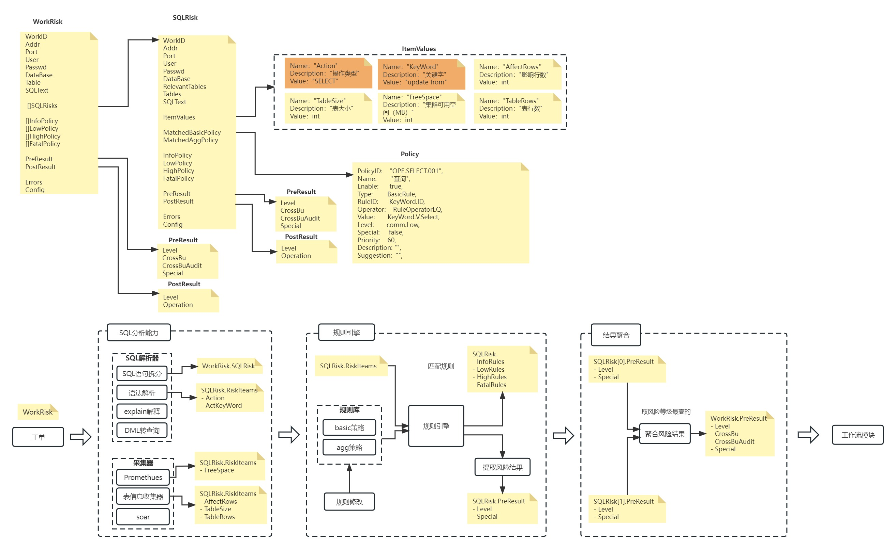

# 简介

`sql-risk`模块实现了对SQL工单的风险识别能力。

# 原理



# 使用

## 1，导入包

```bash
go get github.com/sunkaimr/sql-risk
```

## 2，初始化策略

- 使用配置文件存储策略

```go
// 首次使用时可以先生成默认的策略

// 指定文件存储类型的策略
store := policy.GetStore(policy.FileStoreType, "policy.yaml")
// 初始化策略,并加载策略，若策略文件不存在会创建新的并生成默认策略
err := store.Init()
if err != nil {
    t.Fatal(err)
}

// 需要使用策略时通过GetPolicy()直接查询即可
policy := policy.GetPolicy()

// 重新从策略配置文件加载策略，不建议每次使用都重新加载（建议定期加载或有需要时再加载）
policy, err := store.PolicyReader()
if err != nil {
    t.Fatal(err)
}
```

- 使用mysql存储策略

```go
// 指定mysql存储类型的策略,其中db为‘*gorm.DB’类型
store := policy.GetStore(policy.MysqlStoreType, db)
// 初始化策略,并加载策略，若策略表不存在会创建新的并生成默认策略
err := store.Init()
if err != nil {
    t.Fatal(err)
}

// 需要使用策略时通过GetPolicy()直接查询即可
policy := policy.GetPolicy()

// 重新从数据库加载策略，不建议每次使用都重新加载（建议定期加载或有需要时再加载）
policy, err := store.PolicyReader()
if err != nil {
    t.Fatal(err)
}
```

# 示例

```go
package main

import (
	"fmt"
	"github.com/sunkaimr/sql-risk"
	"github.com/sunkaimr/sql-risk/policy"
)

func main() {
	store := policy.GetStore(policy.FileStoreType, ".policy.yaml")
	err := store.Init()
	if err != nil {
		panic(err)
	}

	addr := "1.2.3.4"
	port := "3306"
	database := "database"
	sql := `delete from table;`
	user := "root"
	passwd := "123456"

	r := sqlrisk.NewSqlRisk("", addr, port, user, passwd, database, sql, nil)
	err = r.IdentifyPreRisk()
	if err != nil {
		panic(err)
	}
	fmt.Printf("%+v", r)
}
```

